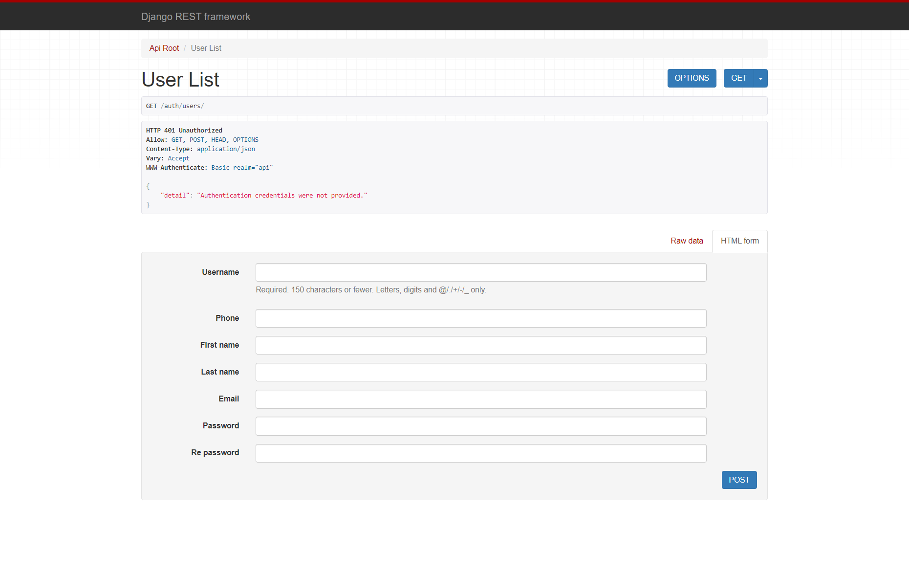

 <h1>Token Based Auth API</h1>
 <h6>A token-based authentication API created with the help of an open source authentication backend in Django called 'Djoser'.</h6>
 
 
 <h2>How to Use This API </h2>
 
 First just run the app with *python manage.py runserver* 
 
 <h3> For /auth/users/ </h3>
 By writing this URL after the localhost one, you will be able to see a screen through which you can add new users. 
 It will look something like this:
 
 
 Fill the form as:
 
 
 After pressing POST, you will see the details of your newly created user in red color in the above block.
 

 <h3> For /auth/token/login/ </h3>
 Next, you need to go to this URL to see if you can log in with the user you created. 
 
 
 In this case, we will be using the user we created in the previous step called Zain.
 
 
 
 You will see that pressing POST will take you to the next page that will give you a token like this:
 
 
 
 *<h4> You can use this token in your logic and frontend to authenticate your app and make sure that a user only gets access to certain allowed parts of your app. This taken will be sent as a part of the user's request to your app </h4>*
 
 

